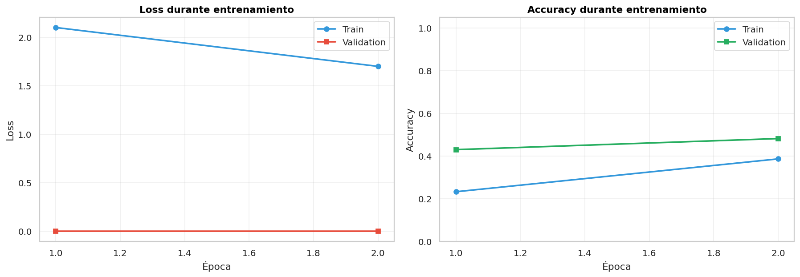
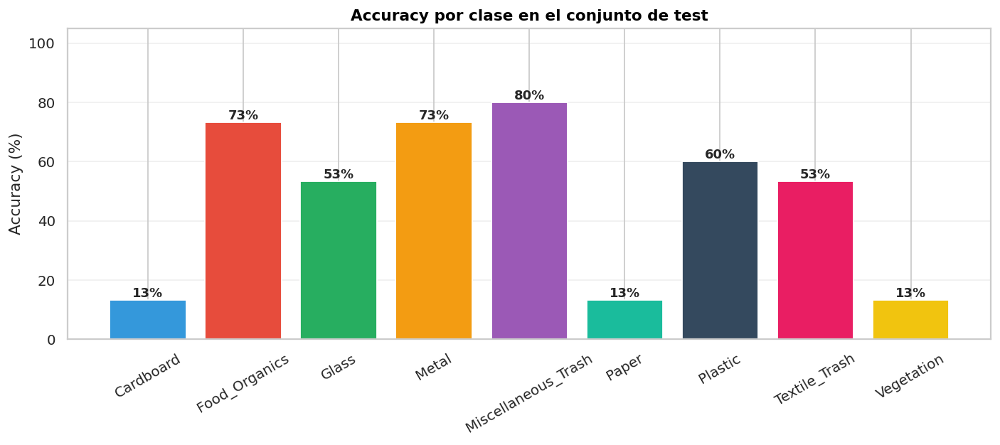

# Avance 2 — Núcleo técnico funcionando

**Fecha:** 08/05/2026 · **Estado:** ✅ Completo

## Resumen

Modelo CNN entrenado y funcionando. MobileNetV2 + Transfer Learning + Fine-tuning logra **48,1 % accuracy** y **F1 macro 0,459** sobre 135 imágenes test.

## Pipeline implementado

1. Carga con `ImageFolder` (9 clases).
2. Augmentación: flips, rotaciones, color jitter.
3. MobileNetV2 ImageNet → custom classifier (Dropout + 64-FC + 9-FC).
4. Entrenamiento 2 fases: frozen (LR=1e-3) + fine-tuning (LR=1e-4).
5. Persistencia: `models/best_model_waste.pt` (~9 MB).

## Resultados

| Métrica | Valor |
|---|---|
| Accuracy | 0,481 |
| F1 macro | 0,459 |
| Random baseline | 0,111 |
| Mejora vs random | × 4,3 |

### Per-class

| Clase | F1 |
|---|---|
| Food Organics | 0,76 ⭐ |
| Metal | 0,67 |
| Textile Trash | 0,62 |
| Plastic | 0,51 |
| Glass | 0,52 |
| Misc Trash | 0,39 |
| Paper | 0,24 |
| Cardboard | 0,24 |
| Vegetation | 0,20 |

## Decisiones justificadas

| Decisión | Motivo |
|---|---|
| MobileNetV2 | 5× más liviano que ResNet, corre en CPU |
| 64×64 | Velocidad CPU; suficiente detalle para residuos |
| Transfer Learning | Solo 435 train; from-scratch necesitaría miles |
| WeightedRandomSampler | Train tenía clases con 35 vs 65 |
| 4 épocas (2+2) | Más épocas saturaban — empezaba overfitting |
