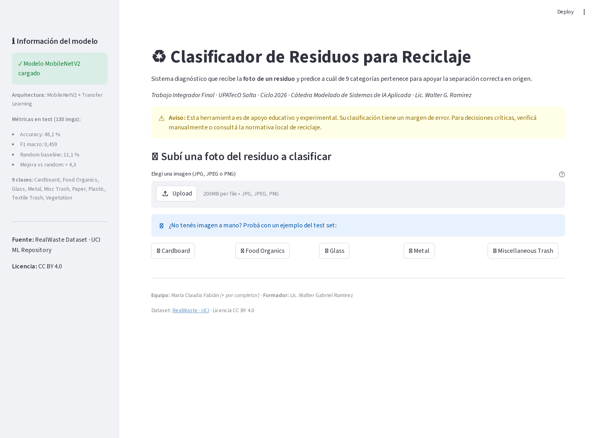
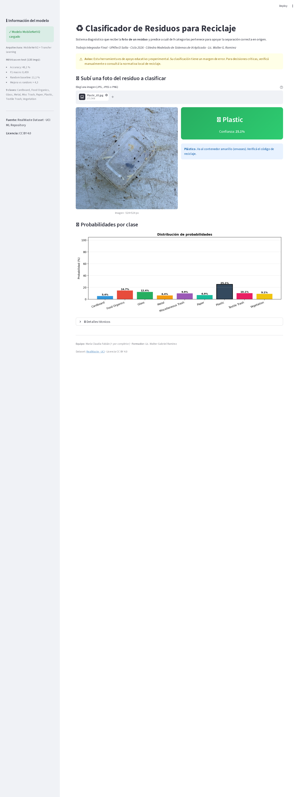

# Avance 3 — App local funcionando

**Fecha:** 29/05/2026 · **Estado:** ✅ Completo

## Resumen

App Streamlit con uploader de imagen carga el modelo y devuelve la predicción de tipo de residuo + probabilidades + recomendación contextual de reciclaje.

## Cómo correr

```bash
pip install -r requirements.txt
streamlit run app/streamlit_app.py
```

## Capturas




## Funcionalidad

| Sección | Descripción |
|---|---|
| Header | Título + caveat ético |
| Sidebar | Info modelo + métricas |
| Uploader | JPG/PNG |
| Predicción | Card grande con clase y probabilidad |
| Bar chart | 9 probabilidades visualizadas |
| Recomendación | Mensaje según tipo de residuo (qué contenedor, cómo reciclarlo) |
