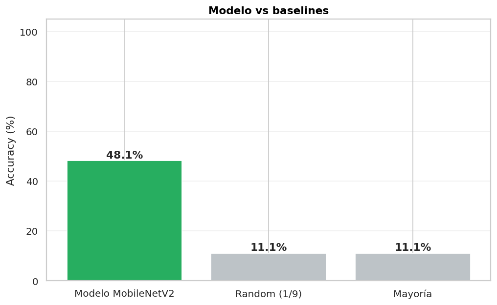
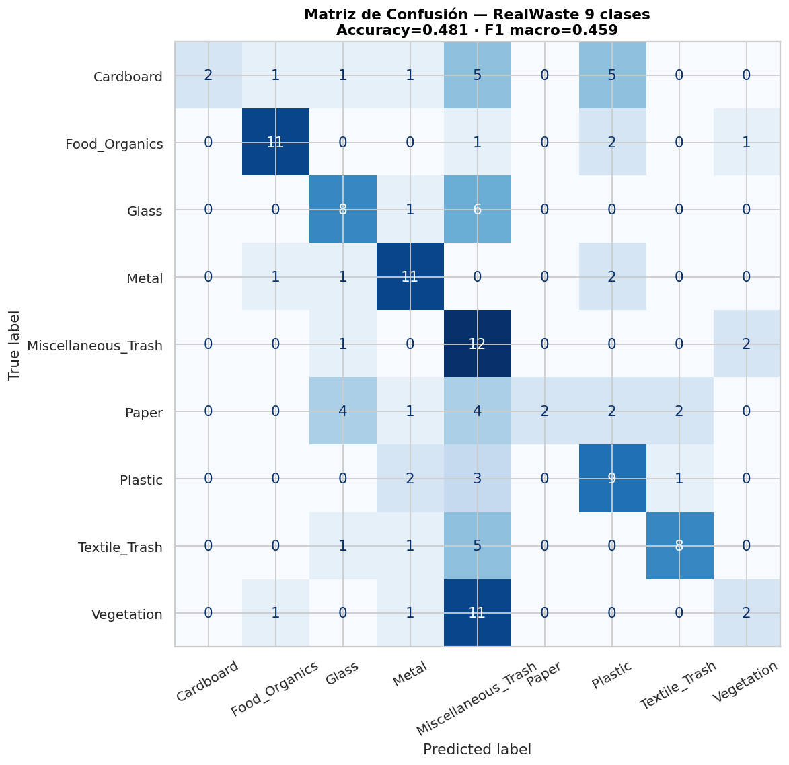
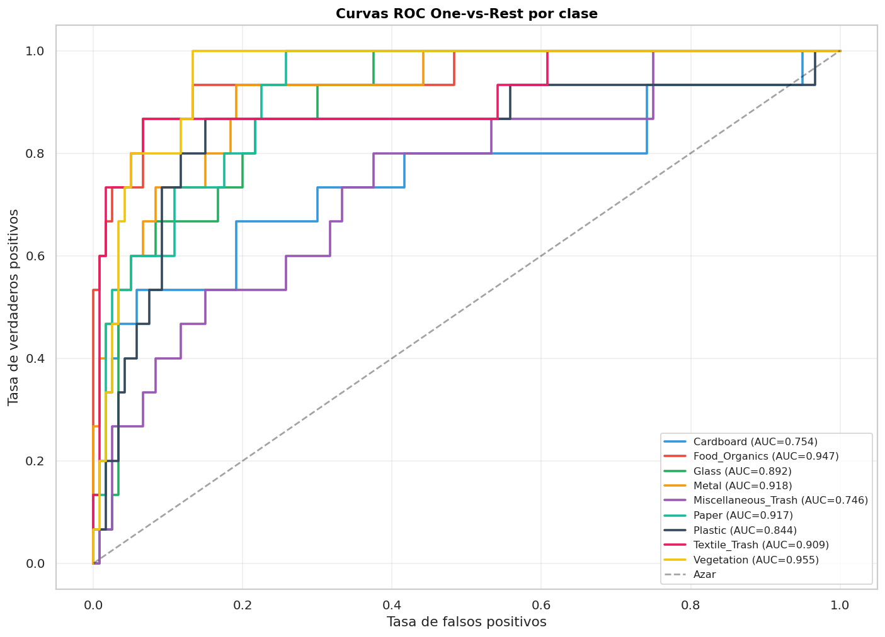
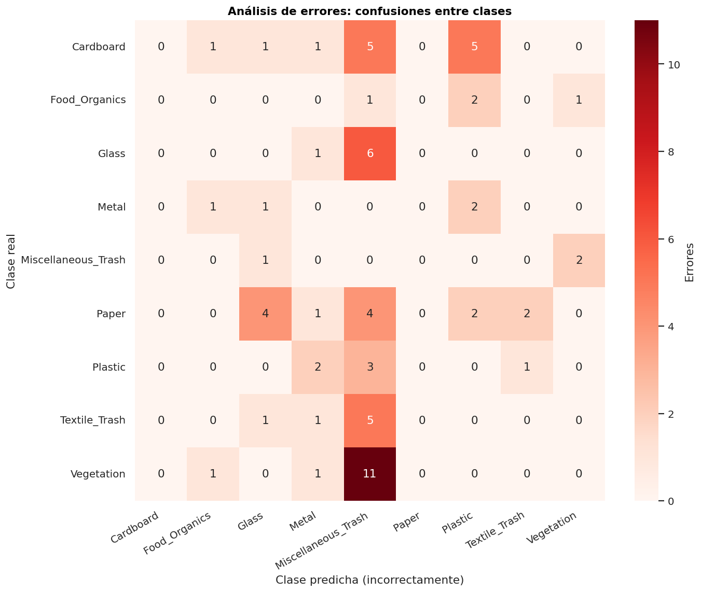

# Avance 4 — Evaluación completa

**Fecha:** 12/06/2026 · **Estado:** ✅ Completo

## Métricas globales

| Métrica | Valor |
|---|---|
| Accuracy | 0,481 |
| F1 macro | 0,459 |
| Random baseline | 0,111 |

## Matriz de confusión 9×9

**Lecturas:**
- **Food Organics, Metal, Textile Trash** son las clases mejor identificadas.
- **Cardboard y Paper** se confunden entre sí (papel y cartón visualmente similares).
- **Vegetation** se confunde con Misc Trash.

## Curvas ROC

AUC promedio > 0,75 — buena separabilidad pese al accuracy moderado.

## Análisis de errores

Patrones principales:
- **Cardboard ↔ Paper:** confusión esperable.
- **Glass ↔ Misc Trash:** vidrios pequeños ambiguos.
- **Vegetation ↔ Misc Trash:** restos vegetales que parecen basura.

## Análisis de límites y riesgos

### Riesgo 1: Generalización a fotos de campo
Modelo entrenado con imágenes en fondo controlado → puede fallar con fotos en contenedores reales.

### Riesgo 2: Items raros
RAEE, residuos peligrosos no están en el dataset → no se clasifican.

## Resumen para audiencia no técnica

> Este sistema usa una red neuronal entrenada con miles de fotos de residuos para reconocer 9 categorías. Acierta en aproximadamente **5 de cada 10 casos** (vs 1 de cada 9 al azar). Es especialmente bueno con orgánicos, metal y textil. Le cuesta más con vegetación y papel/cartón. **No reemplaza el etiquetado correcto** ni una clasificación industrial certificada.
